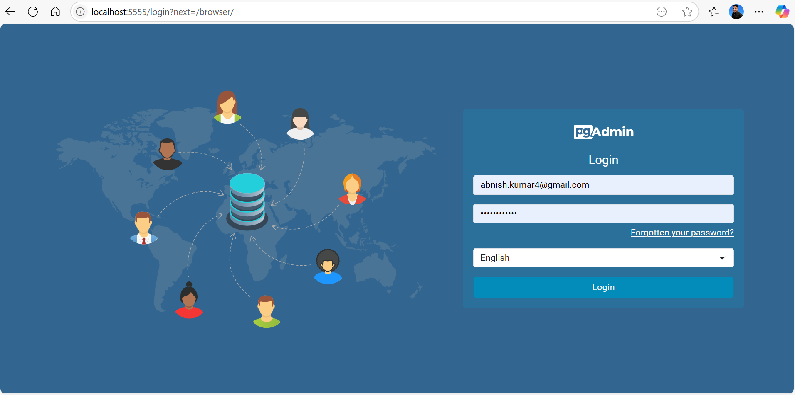
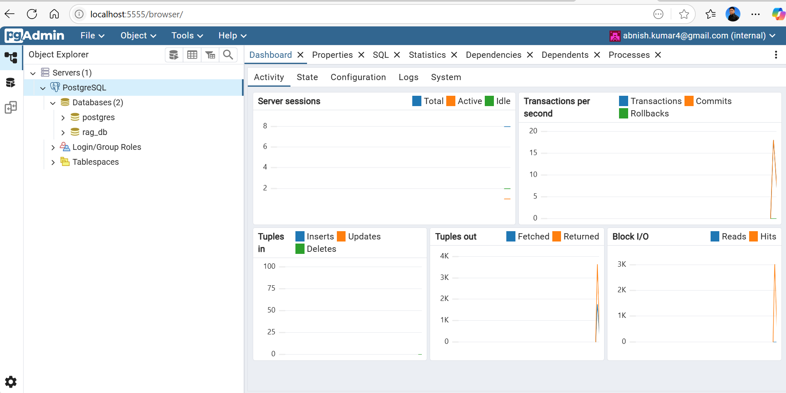

# Setting Up Pre-configured PostgreSQL Database with pgAdmin4 and pgvector in Docker

## Prerequisites
- **Docker** installed and running
- **Docker Compose** installed

This project provides a `docker-compose` setup to easily spin up:
- A **PostgreSQL** database with the `pgvector` extension pre-installed.
- An instance of **pgAdmin4** for database management via a web browser.
- Auto-loading of predefined `.sql` files into PostgreSQL.
- Automatic creation of the `pgvector` extension in all databases.

---

## 1. Project Structure

├── docker-compose.yml # Service definitions for Postgres & pgAdmin
├── run_docker.sh # Script to build, run, and seed the databases
├── .env # Environment configuration
├── pgadmin/servers.json # Auto-generated pgAdmin server configuration
└── sql/ # Folder for .sql database dump/schema files


---

## 2. Create the `.env` File

Create a `.env` file in the root of your project (same directory as `docker-compose.yml`):

```env
# PostgreSQL Database (pgvector enabled)
POSTGRES_USER=postgres
POSTGRES_PASSWORD=password
POSTGRES_DB=rag_db
DB_PORT=5432

# pgAdmin4
PGADMIN_DEFAULT_EMAIL=abnish.kumar4@gmail.com
PGADMIN_DEFAULT_PASSWORD=password@123
PGADMIN_PORT=5555
```
- The .env file is automatically loaded by run_docker.sh and docker-compose.yml.

3. Add SQL Dump Files (Optional)

Place .sql files inside the sql/ folder.

Each file name (without .sql) will become the database name.

Example:

sql/
  rag_db.sql   --> Creates database `rag_db` and loads this file

If no .sql files are present, only the default database from .env (POSTGRES_DB) will be created.

5. Access pgAdmin4

Once the containers are running:

Open your browser and go to:
http://localhost:5555



Log in with:

Email: PGADMIN_DEFAULT_EMAIL from .env

Password: PGADMIN_DEFAULT_PASSWORD from .env

You will see a server named "PostgreSQL" already configured and pointing to the container database.

